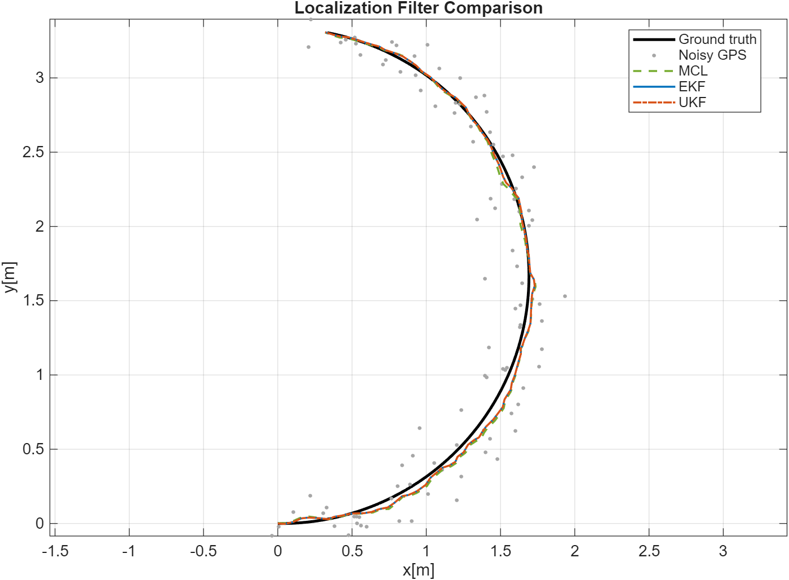

# Robot Localization Filters in MATLAB

A reproducible MATLAB simulation comparing three probabilistic localization methods for a differential-drive robot:

* Extended Kalman Filter (EKF)
* Unscented Kalman Filter (UKF)
* Monte Carlo Localization (MCL)

The filters estimate the robot pose `[x, y, θ]` from noisy odometry, GPS, and IMU measurements.



## How it works

The simulation:

1. Generates a ground-truth trajectory using a differential-drive motion model.
2. Adds noise to the odometry, GPS, and IMU measurements.
3. Runs EKF, UKF, and MCL using the same sensor data.
4. Compares their position and orientation estimates.
5. Reports position and angular error metrics.

The random seed is fixed with `rng(40)`, so repeated runs use the same simulated measurements and particle samples.

## Filters

| Filter | Implementation                                                                |
| ------ | ----------------------------------------------------------------------------- |
| EKF    | Linearizes the nonlinear motion model using its Jacobian.                     |
| UKF    | Propagates sigma points through the nonlinear motion model.                   |
| MCL    | Uses 800 weighted particles and resampling based on GPS and IMU measurements. |

Angular innovations and estimates are handled using wrapped angles.

## Simulation setup

| Parameter                        |                        Value |
| -------------------------------- | ---------------------------: |
| Simulation duration              |                         10 s |
| Time step                        |                        0.1 s |
| Linear velocity                  |                      0.5 m/s |
| Angular velocity                 |                    0.3 rad/s |
| GPS standard deviation           |                       0.12 m |
| IMU standard deviation           |                           4° |
| Odometry linear-velocity noise   |                     0.08 m/s |
| Odometry angular-velocity noise  |                         2°/s |
| Initial state standard deviation | `[0.05 m, 0.05 m, 0.05 rad]` |
| MCL particles                    |                          800 |

## Results

The following results come from one reproducible simulation using the parameters above.

| Filter | Position RMSE | Angular RMSE | Maximum position error | Position-error standard deviation |
| ------ | ------------: | -----------: | ---------------------: | --------------------------------: |
| EKF    |      0.0367 m |        0.70° |               0.0746 m |                          0.0181 m |
| UKF    |      0.0366 m |        0.70° |               0.0743 m |                          0.0180 m |
| MCL    |      0.0431 m |        0.76° |               0.0812 m |                          0.0206 m |

All three filters tracked the simulated trajectory closely. In this run, EKF and UKF produced nearly identical estimates, while MCL showed slightly higher position and angular errors.

Results may change with different trajectories, noise levels, initialization assumptions, or particle counts.

## Requirements

* MATLAB
* Statistics and Machine Learning Toolbox, used for weighted particle resampling with `datasample`

## Running the simulation

Clone the repository:

```bash
git clone https://github.com/juls-ag/localization_filters.git
cd localization_filters
```

Run it from MATLAB:

```matlab
main_filtros
```

Or from a terminal:

```bash
matlab -batch "main_filtros"
```

The script displays the metrics, creates the simulation figures, and exports:

```text
results/localization_comparison.png
```

## Project structure

| File             | Purpose                                                                                                        |
| ---------------- | -------------------------------------------------------------------------------------------------------------- |
| `main_filtros.m` | Configures the simulation, generates sensor data, runs the filters, calculates metrics, and creates the plots. |
| `movimiento.m`   | Differential-drive motion model.                                                                               |
| `eKf_l.m`        | Extended Kalman Filter implementation.                                                                         |
| `ukf_l.m`        | Unscented Kalman Filter implementation.                                                                        |
| `mcl_l.m`        | Monte Carlo Localization implementation.                                                                       |
| `results/`       | Exported comparison figure used in this README.                                                                |

## Development note

This project began as an individual university assignment on probabilistic robot localization. No starter implementation was provided. I developed and integrated the simulation using course concepts, MATLAB documentation, online references, and AI-assisted development.

I later revisited the project to correct the temporal alignment between predictions and measurements, make the noise and initialization assumptions consistent across the three filters, improve the MCL implementation, add orientation metrics, and document reproducible results.
